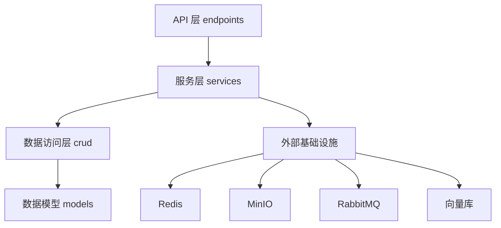
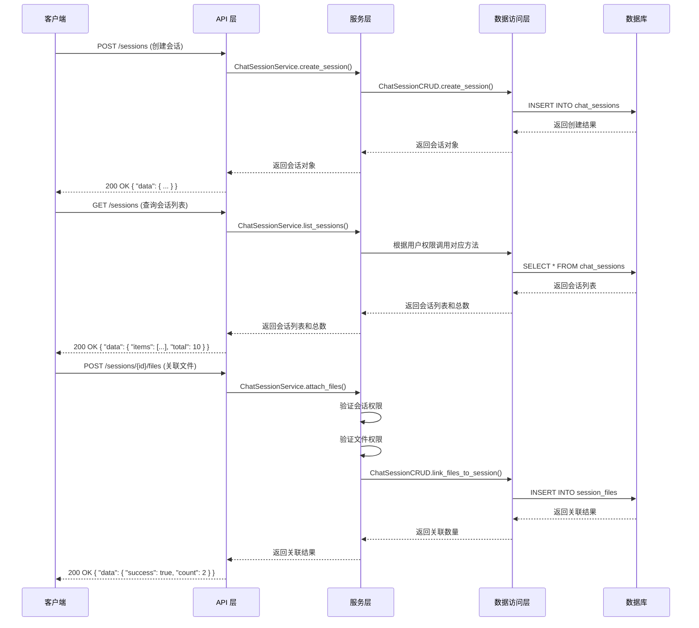
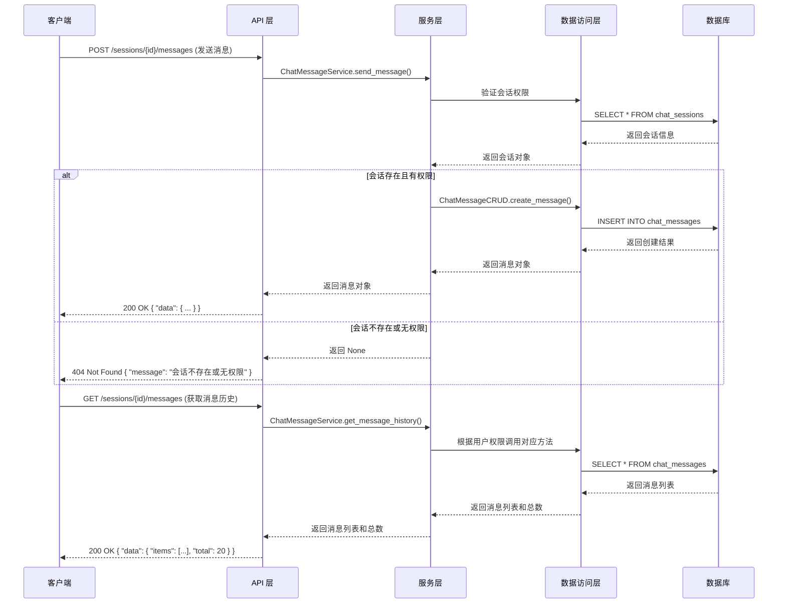
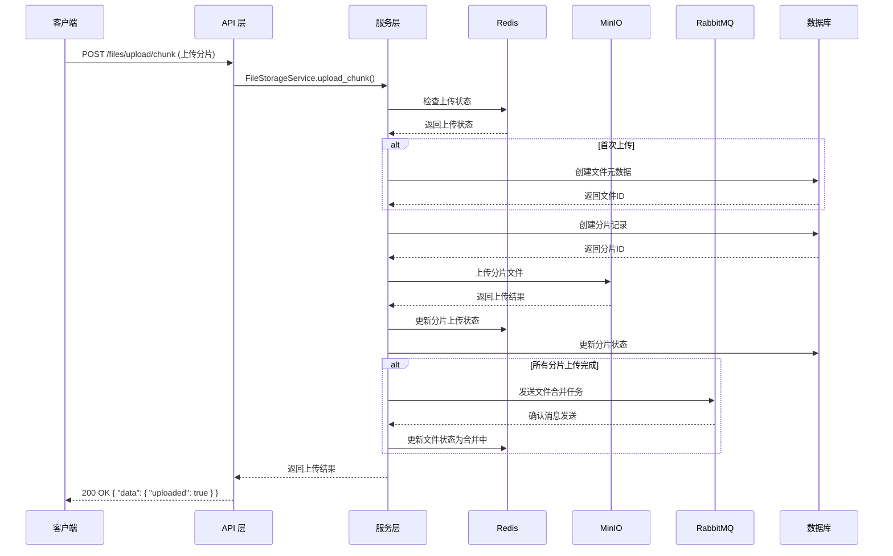
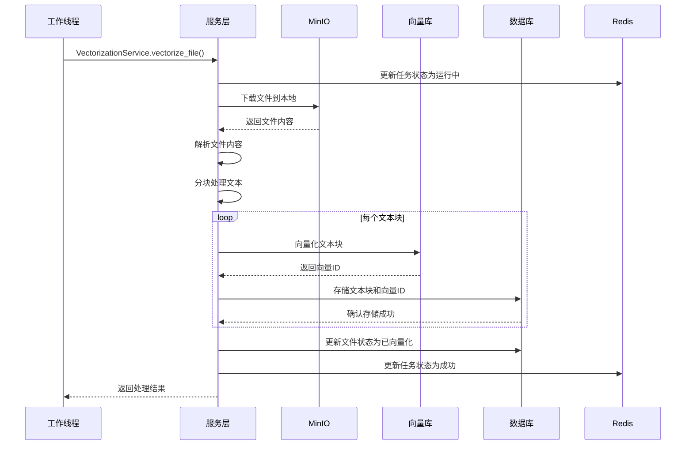

# 项目设计文档

## 1. 项目架构概述

My-RAG-Demo 是一个基于 RAG (Retrieval-Augmented Generation) 技术的智能对话系统后端项目。该项目采用分层架构设计，遵循现代后端开发最佳实践，实现了会话管理、消息处理、文件存储、向量化处理等核心功能。

### 1.1 分层架构

项目采用经典的三层架构设计：

1. **API 层**：负责接收和响应 HTTP 请求，参数验证，权限控制
2. **服务层**：负责业务逻辑处理，协调各个模块的交互
3. **数据层**：负责数据存取，与数据库、缓存、存储等基础设施交互

### 1.2 核心功能模块

- **会话管理**：创建、查询、删除会话，管理会话与文件的关联
- **消息处理**：发送消息，获取消息历史，生成 AI 回复
- **文件管理**：分片上传，文件元数据管理，公共文件查询
- **向量化处理**：文件分块，文本向量化，向量存储
- **用户管理**：用户 CRUD 操作，权限控制
- **基础设施**：Redis 缓存，MinIO 对象存储，RabbitMQ 消息队列

## 2. 模块划分

### 2.1 目录结构

```
backend/
  ├── app/
  │   ├── api/
  │   │   └── v1/
  │   │       └── endpoints/      # API 接口定义
  │   ├── services/               # 业务服务层
  │   ├── models/                 # 数据模型
  │   ├── schemas/                # 数据传输对象
  │   ├── crud/                   # 数据访问层
  │   ├── dependencies/           # 依赖注入
  │   └── core/                   # 核心配置和工具
```

### 2.2 endpoints 模块

**职责**：

- 定义 API 接口路由和处理函数
- 处理 HTTP 请求和响应
- 进行参数验证和错误处理
- 实现权限控制和身份认证
- 调用服务层方法处理业务逻辑

**核心文件**：
- `chat_sessions.py`：会话管理相关接口
- `chat_messages.py`：消息处理相关接口
- `files.py`：文件管理相关接口
- `users.py`：用户管理相关接口
- `health.py`：健康检查接口
- `infra_demo.py`：基础设施演示接口

**设计特点**：
- 使用 FastAPI 框架，自动生成 API 文档
- 采用依赖注入模式管理数据库会话、用户认证等
- 统一响应格式，使用 `ApiResponse` 包装所有返回结果
- 清晰的接口分类和路由组织

### 2.3 services 模块

**职责**：
- 实现核心业务逻辑
- 协调多个 CRUD 操作完成复杂业务流程
- 处理权限验证和业务规则
- 与外部服务和基础设施交互
- 提供事务管理和错误处理

**核心文件**：
- `chat_session_service.py`：会话管理业务逻辑
- `chat_message_service.py`：消息处理业务逻辑
- `file_storage_service.py`：文件存储业务逻辑
- `users_service.py`：用户管理业务逻辑
- `vectorization_service.py`：向量化处理业务逻辑

**设计特点**：
- 服务类与 API 接口一一对应，职责清晰
- 支持权限控制，区分普通用户和管理员权限
- 预留接口用于后续功能扩展，如 AI 回复生成
- 集成多种基础设施，如 Redis、MinIO、RabbitMQ

### 2.4 模块间关系



- **API 层**：调用服务层方法，处理 HTTP 协议相关逻辑
- **服务层**：实现业务逻辑，调用数据访问层方法，与外部基础设施交互
- **数据访问层**：封装数据库操作，提供 CRUD 方法
- **数据模型**：定义数据库表结构和关系
- **外部基础设施**：提供缓存、存储、消息队列等服务

## 3. 核心业务流程

### 3.1 会话管理流程



### 3.2 消息处理流程



### 3.3 文件上传流程



### 3.4 文件向量化流程



## 4. 数据模型设计

### 4.1 用户模型 (User)

| 字段名 | 数据类型 | 约束 | 说明 |
|--------|----------|------|------|
| id | integer | PRIMARY KEY | 用户ID |
| username | string | UNIQUE | 用户名 |
| password | string | NOT NULL | 密码 |
| name | string | NOT NULL | 姓名 |
| gender | string | | 性别 |
| phone | string | | 电话 |
| email | string | | 邮箱 |
| avatar_file_id | integer | FOREIGN KEY | 头像文件ID |
| bio | string | | 个人简介 |
| role | string | DEFAULT 'user' | 角色，如 'user'、'admin' |
| created_at | datetime | DEFAULT CURRENT_TIMESTAMP | 创建时间 |
| updated_at | datetime | DEFAULT CURRENT_TIMESTAMP ON UPDATE CURRENT_TIMESTAMP | 更新时间 |

### 4.2 会话模型 (ChatSession)

| 字段名 | 数据类型 | 约束 | 说明 |
|--------|----------|------|------|
| id | integer | PRIMARY KEY | 会话ID |
| title | string | NOT NULL | 会话标题 |
| biz_type | string | NOT NULL | 业务类型 |
| context_id | integer | | 上下文ID |
| user_id | integer | FOREIGN KEY | 用户ID |
| status | integer | DEFAULT 1 | 状态，0-禁用，1-启用 |
| created_at | datetime | DEFAULT CURRENT_TIMESTAMP | 创建时间 |
| updated_at | datetime | DEFAULT CURRENT_TIMESTAMP ON UPDATE CURRENT_TIMESTAMP | 更新时间 |

### 4.3 消息模型 (ChatMessage)

| 字段名 | 数据类型 | 约束 | 说明 |
|--------|----------|------|------|
| id | integer | PRIMARY KEY | 消息ID |
| session_id | integer | FOREIGN KEY | 会话ID |
| user_id | integer | FOREIGN KEY | 用户ID |
| content | text | NOT NULL | 消息内容 |
| role | string | DEFAULT 'user' | 角色，如 'user'、'assistant' |
| model_name | string | | 模型名称 |
| created_at | datetime | DEFAULT CURRENT_TIMESTAMP | 创建时间 |

### 4.4 文件存储模型 (FileStorage)

| 字段名 | 数据类型 | 约束 | 说明 |
|--------|----------|------|------|
| id | integer | PRIMARY KEY | 文件ID |
| user_id | integer | FOREIGN KEY | 用户ID |
| filename | string | NOT NULL | 文件名 |
| content_type | string | NOT NULL | 文件MIME类型 |
| file_size | bigint | NOT NULL | 文件大小（字节） |
| bucket_name | string | NOT NULL | 存储桶名称 |
| object_name | string | NOT NULL | 对象名称 |
| etag | string | NOT NULL | 文件MD5 |
| is_public | boolean | DEFAULT false | 是否为公共文件 |
| status | integer | DEFAULT 0 | 状态，0-上传中，1-已上传，2-已向量化，3-失败 |
| created_at | datetime | DEFAULT CURRENT_TIMESTAMP | 创建时间 |
| updated_at | datetime | DEFAULT CURRENT_TIMESTAMP ON UPDATE CURRENT_TIMESTAMP | 更新时间 |

### 4.5 文件分片模型 (FileChunks)

| 字段名 | 数据类型 | 约束 | 说明 |
|--------|----------|------|------|
| id | integer | PRIMARY KEY | 分片ID |
| file_md5 | string | NOT NULL | 文件MD5 |
| chunk_index | integer | NOT NULL | 分片索引 |
| chunk_size | integer | NOT NULL | 分片大小（字节） |
| bucket_name | string | NOT NULL | 存储桶名称 |
| object_name | string | NOT NULL | 对象名称 |
| status | integer | DEFAULT 0 | 状态，0-上传中，1-已上传，2-失败 |
| etag | string | | 分片MD5 |
| created_at | datetime | DEFAULT CURRENT_TIMESTAMP | 创建时间 |
| updated_at | datetime | DEFAULT CURRENT_TIMESTAMP ON UPDATE CURRENT_TIMESTAMP | 更新时间 |

### 4.6 会话文件关联模型 (SessionFile)

| 字段名 | 数据类型 | 约束 | 说明 |
|--------|----------|------|------|
| id | integer | PRIMARY KEY | 关联ID |
| session_id | integer | FOREIGN KEY | 会话ID |
| file_id | integer | FOREIGN KEY | 文件ID |
| created_at | datetime | DEFAULT CURRENT_TIMESTAMP | 创建时间 |

### 4.7 RAG 文本块模型 (RagChunk)

| 字段名 | 数据类型 | 约束 | 说明 |
|--------|----------|------|------|
| id | integer | PRIMARY KEY | 文本块ID |
| file_id | integer | FOREIGN KEY | 文件ID |
| chunk_index | integer | NOT NULL | 块索引 |
| chunk_text | text | NOT NULL | 文本内容 |
| chunk_tokens | integer | NOT NULL | 词元数量 |
| page_no | integer | | 页码 |
| section | string | | 章节 |
| embedding_id | string | | 向量ID |
| created_at | datetime | DEFAULT CURRENT_TIMESTAMP | 创建时间 |

## 5. 接口与服务层的交互逻辑

### 5.1 交互模式

API 层与服务层的交互采用典型的请求-响应模式：

1. **API 层**：接收 HTTP 请求，解析参数，进行初步验证
2. **API 层**：调用服务层对应方法，传递必要参数
3. **服务层**：执行业务逻辑，处理权限验证
4. **服务层**：调用 CRUD 方法操作数据库
5. **服务层**：返回处理结果给 API 层
6. **API 层**：包装响应结果，返回给客户端

### 5.2 依赖注入

项目使用 FastAPI 的依赖注入系统，实现了以下依赖：

- `get_db`：获取数据库会话
- `get_current_user`：获取当前登录用户
- `get_redis`：获取 Redis 客户端
- `get_minio`：获取 MinIO 客户端
- `get_rabbitmq_channel`：获取 RabbitMQ 通道

这些依赖在 API 层通过 `Depends()` 注入，然后传递给服务层使用。

### 5.3 权限控制

权限控制主要在服务层实现，通过以下方式：

1. **用户身份验证**：API 层通过 `get_current_user` 依赖获取当前用户
2. **权限检查**：服务层根据用户角色（普通用户/管理员）执行不同的逻辑
3. **数据访问控制**：普通用户只能访问自己的数据，管理员可以访问所有数据

### 5.4 错误处理

错误处理采用分层设计：

1. **API 层**：捕获服务层返回的错误，转换为 HTTP 响应
2. **服务层**：处理业务逻辑错误，返回适当的错误信息
3. **CRUD 层**：处理数据库操作错误，抛出异常给服务层

## 6. 技术选型说明

### 6.1 核心框架

- **FastAPI**：现代化 Python Web 框架，提供自动 API 文档生成、类型提示等功能
- **SQLAlchemy**：ORM 框架，简化数据库操作
- **Pydantic**：数据验证和序列化库，用于请求和响应模型

### 6.2 数据库

- **PostgreSQL**：关系型数据库，支持复杂查询和事务

### 6.3 缓存

- **Redis**：用于缓存热点数据、管理上传状态、分布式锁等

### 6.4 对象存储

- **MinIO**：兼容 S3 协议的对象存储服务，用于存储文件和分片

### 6.5 消息队列

- **RabbitMQ**：用于处理异步任务，如文件合并、向量化处理等

### 6.6 向量库

- **Milvus**（预留）：用于存储和检索向量数据

### 6.7 其他工具

- **LangChain**（预留）：用于构建 LLM 应用，实现 RAG 功能
- **Ollama**（预留）：本地 LLM 运行时，用于生成 AI 回复

## 7. 关键实现细节

### 7.1 分片上传实现

- **断点续传**：使用 Redis bitmap 记录分片上传状态
- **幂等性**：通过文件 MD5 和分片索引确保重复上传不会导致错误
- **并发控制**：使用 Redis 实现简单的并发控制
- **错误处理**：实现了分片上传失败的重试机制

### 7.2 权限控制实现

- **基于角色的访问控制**：区分普通用户和管理员权限
- **数据级权限**：普通用户只能访问和操作自己的数据
- **文件权限**：普通用户只能关联自己的或公共文件

### 7.3 向量化处理实现

- **文件解析**：支持 PDF 和文本文件的解析
- **文本分块**：实现了基于词数的分块策略，支持重叠
- **向量化**：预留了向量库接口，目前使用 MD5 作为向量 ID 占位

### 7.4 响应格式统一

- **统一响应结构**：所有 API 接口返回统一的 `ApiResponse` 格式
- **状态码管理**：使用标准 HTTP 状态码
- **错误信息标准化**：错误响应包含详细的错误信息

## 8. 潜在风险及解决方案

### 8.1 潜在风险

1. **文件上传失败**：
   - 风险：网络中断、存储服务故障等导致文件上传失败
   - 影响：用户体验差，数据不完整

2. **向量化处理耗时**：
   - 风险：大文件向量化处理时间长，可能导致服务超时
   - 影响：系统响应慢，用户等待时间长

3. **向量库性能**：
   - 风险：向量数据量大时，检索性能下降
   - 影响：RAG 系统响应慢，用户体验差

4. **权限管理漏洞**：
   - 风险：权限控制不当，可能导致未授权访问
   - 影响：数据安全问题，用户隐私泄露

5. **基础设施依赖**：
   - 风险：Redis、MinIO、RabbitMQ 等服务故障
   - 影响：系统功能不可用，服务降级

### 8.2 解决方案

1. **文件上传失败**：
   - 实现断点续传机制，支持分片重传
   - 增加上传状态监控和重试机制
   - 提供文件上传状态查询接口

2. **向量化处理耗时**：
   - 使用异步任务队列处理向量化操作
   - 实现任务状态查询接口
   - 考虑使用更高效的向量化模型

3. **向量库性能**：
   - 优化向量索引结构
   - 考虑使用分布式向量库
   - 实现向量数据缓存机制

4. **权限管理漏洞**：
   - 严格实现基于角色的访问控制
   - 增加权限验证单元测试
   - 定期进行安全审计

5. **基础设施依赖**：
   - 实现服务降级机制
   - 增加基础设施健康检查
   - 考虑使用容器化部署，提高可靠性

## 9. 扩展性设计考虑

### 9.1 模块扩展

- **API 版本管理**：通过 URL 路径前缀实现版本控制，如 `/api/v1/`、`/api/v2/`
- **服务层插件化**：设计服务层接口，支持不同实现的替换
- **数据层抽象**：使用接口抽象数据访问，支持不同数据库的替换

### 9.2 功能扩展

- **多模型支持**：预留了模型名称字段，支持集成多种 LLM
- **多文件格式**：预留了文件解析接口，支持扩展更多文件格式
- **多向量库**：设计了向量库抽象接口，支持不同向量库的集成
- **多语言支持**：代码结构支持国际化扩展

### 9.3 性能扩展

- **缓存策略**：预留了缓存接口，支持多级缓存
- **异步处理**：使用 asyncio 实现异步操作，提高并发性能
- **负载均衡**：支持水平扩展，通过负载均衡分发请求
- **数据库优化**：预留了数据库索引优化、查询优化的空间

### 9.4 部署扩展

- **容器化**：支持 Docker 容器化部署
- **微服务**：模块设计支持拆分为微服务架构
- **CI/CD**：预留了 CI/CD 集成的空间
- **监控告警**：预留了监控指标采集的接口

## 10. 总结

My-RAG-Demo 项目采用现代后端开发技术栈，实现了一个功能完整的 RAG 对话系统后端。项目架构清晰，模块划分合理，代码结构规范，为后续功能扩展和性能优化提供了良好的基础。

通过本文档的详细说明，开发人员可以快速理解项目的设计思路和实现细节，便于后续的维护和扩展。同时，本文档也为前端开发人员提供了清晰的 API 使用指南，促进前后端协作的顺畅进行。

项目的核心价值在于：
1. 提供了完整的 RAG 系统后端架构参考
2. 实现了可靠的文件上传和管理功能
3. 设计了灵活的权限控制系统
4. 预留了丰富的扩展接口，支持未来功能的迭代

随着 LLM 技术的不断发展和应用场景的不断丰富，My-RAG-Demo 项目有望成为一个功能强大、性能优异的智能对话系统解决方案。
